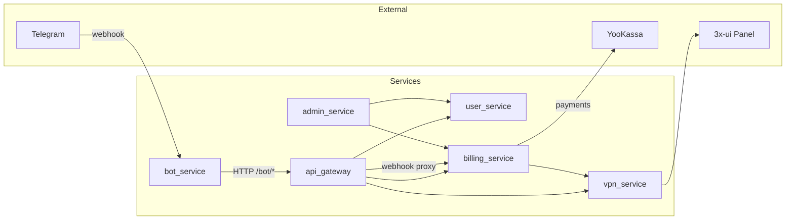

# Service Dependencies

Документ фиксирует реальные точки межсервисного взаимодействия и внешние зависимости по коду проекта.

## Граф вызовов

- **bot_service** вызывает только **api_gateway** (BFF). К user/billing/vpn напрямую не обращается.
- **api_gateway** вызывает **user_service**, **billing_service**, **vpn_service**; дополнительно проксирует webhook YooKassa в billing.
- **billing_service** вызывает **vpn_service** (provision, extend, disable, enable) и внешний API **YooKassa**.
- **admin_service** вызывает **user_service** и **billing_service**. Клиент к vpn_service создаётся в lifespan, но в роутах не используется (см. [current_client_map.md](current_client_map.md)).
- **user_service**, **vpn_service** не вызывают другие сервисы (vpn_service общается только с 3x-ui Panel).

---

## Вызовы по направлениям

### bot_service → api_gateway

| Файл | Класс/функция | Что вызывается |
|------|----------------|----------------|
| `services/bot_service/app/services/api_client.py` | `APIClient` | `POST /bot/me`, `GET /bot/me`, `GET /bot/plans`, `POST /bot/orders`, `GET /bot/orders/{id}`, `GET /bot/subscription`, `POST /bot/subscription/extend` |
| `services/bot_service/app/main.py` | — | Создание `APIClient(base_url=settings.api_gateway_url)`, передача в `dp["api_client"]` |

Хендлеры бота (start, payments, plans, subscription и др.) получают клиент из `dp["api_client"]` и вызывают его методы. Контракт: JSON request/response, без использования shared Pydantic-схем на границе bot ↔ gateway.

---

### api_gateway → user_service, billing_service, vpn_service

| Направление | Файл | Как вызывается |
|-------------|------|----------------|
| → user_service | `services/api_gateway/app/routes/bot.py` | `_user_client(request)` → `request.app.state.user_client`. Методы: `register_or_get`, `get_by_telegram_id`. |
| → billing_service | `services/api_gateway/app/routes/bot.py` | `_billing_client(request)` → `request.app.state.billing_client`. Методы: `get_active_subscription`, `list_plans`, `create_order`, `get_order`, `extend_subscription`. |
| → vpn_service | `services/api_gateway/app/routes/bot.py` | `_vpn_client(request)` → `request.app.state.vpn_client`. Метод: `get_access(subscription_id)` (только в `get_subscription` при наличии подписки). |

Клиенты создаются в `services/api_gateway/app/main.py` в lifespan и кладутся в `application.state`.

### api_gateway → billing_service (webhook proxy)

| Файл | Описание |
|------|----------|
| `services/api_gateway/app/routes/webhooks.py` | `POST /webhooks/yookassa`: принимает запрос от YooKassa, пересылает тело и Content-Type в `{billing_service_url}/webhooks/yookassa` через разовый `httpx.AsyncClient`. Заголовок `X-Service-Key` не добавляется (billing для `/webhooks` его не требует — см. ServiceAuthMiddleware). |

---

### billing_service → vpn_service

| Файл | Где используется vpn_client |
|------|----------------------------|
| `services/billing_service/app/main.py` | В lifespan создаётся `VPNServiceClient`, сохраняется в `_app.state.vpn_client`. |
| `services/billing_service/app/routes/order.py` | При создании заказа клиент не вызывается (оплата через YooKassa). |
| `services/billing_service/app/routes/subscription.py` | `_billing(request, session)` строит `BillingService(session, yookassa, request.app.state.vpn_client)`; вызовы `extend_subscription`, `revoke_subscription` внутри BillingService дергают VPN (extend/disable). |
| `services/billing_service/app/routes/webhook.py` | То же: `BillingService(..., request.app.state.vpn_client)`; при успешной оплате `process_payment_notification` вызывает `_vpn.provision(...)`. |
| `services/billing_service/app/services/billing.py` | `BillingService` в конструкторе принимает `vpn_client: VPNServiceClient`. Вызовы: `provision`, `extend`, `disable` (при revoke). |

---

### admin_service → user_service, billing_service

| Направление | Файлы роутов | Методы клиентов |
|-------------|--------------|-----------------|
| → user_service | `app/routes/users.py`, `app/routes/dashboard.py` | `get_by_telegram_id`, `list_users` |
| → billing_service | `app/routes/plans.py`, `app/routes/orders.py`, `app/routes/subscriptions.py`, `app/routes/dashboard.py` | `list_plans`, `get_plan`, `create_plan`, `update_plan`, `list_orders`, `list_subscriptions`, `extend_subscription`, `revoke_subscription` |

Клиенты берутся из `request.app.state.user_client`, `request.app.state.billing_client`. Создание — в `services/admin_service/app/main.py`, lifespan.

---

## Критичные интеграционные точки

1. **Создание заказа и webhook YooKassa (billing + VPN)**  
   Пользователь платит → YooKassa шлёт webhook в api_gateway → прокси в billing → billing создаёт подписку и вызывает vpn_service `provision`. Сбой vpn_service или неверные пути (см. inconsistency в [current_client_map.md](current_client_map.md)) приводят к оплаченному заказу без выданного VPN.

2. **Получение подписки и VPN-доступа для бота**  
   Бот запрашивает через api_gateway `GET /bot/subscription` → gateway дергает user, billing (active subscription), при наличии подписки — vpn_service `get_access`. Отказ любого из сервисов ломает ответ целиком.

3. **Продление и отзыв подписки (billing → vpn)**  
   В `extend_subscription` и `revoke_subscription` billing меняет данные в БД и вызывает vpn_service `extend` / `disable`. Рассогласование состояний при падении VPN после обновления БД — риск.

4. **Webhook YooKassa**  
   Единственная точка входа платежей от провайдера. Прокси в api_gateway не добавляет служебных заголовков; при ужесточении политики на billing (например, проверка источника) конфигурация может потребовать изменений.

---

## Внешние зависимости

| Зависимость | Сервис | Файл/место | Описание |
|-------------|--------|------------|----------|
| **YooKassa** | billing_service | `app/services/yookassa.py` | Создание платежа (`POST https://api.yookassa.ru/v3/payments`), проверка и разбор уведомления в webhook. |
| **3x-ui Panel** | vpn_service | `app/adapters/xui.py` (XUIAdapter) | Логин, создание/обновление клиента, трафик, ссылка на конфиг. Все вызовы к панели идут через этот адаптер. |
| **Telegram (webhook)** | bot_service | `app/main.py` | `bot.set_webhook(url)` при старте, `bot.delete_webhook()` при остановке; роут `POST /webhook/bot` принимает Update и передаёт в Dispatcher. |

---

## Что не найдено в коде

- Явного health-check между сервисами (например, gateway не проверяет доступность user/billing/vpn перед маршрутизацией).
- Общих Pydantic-схем на границе bot ↔ api_gateway (gateway определяет свои Request Body, ответы — `dict[str, Any]`).
